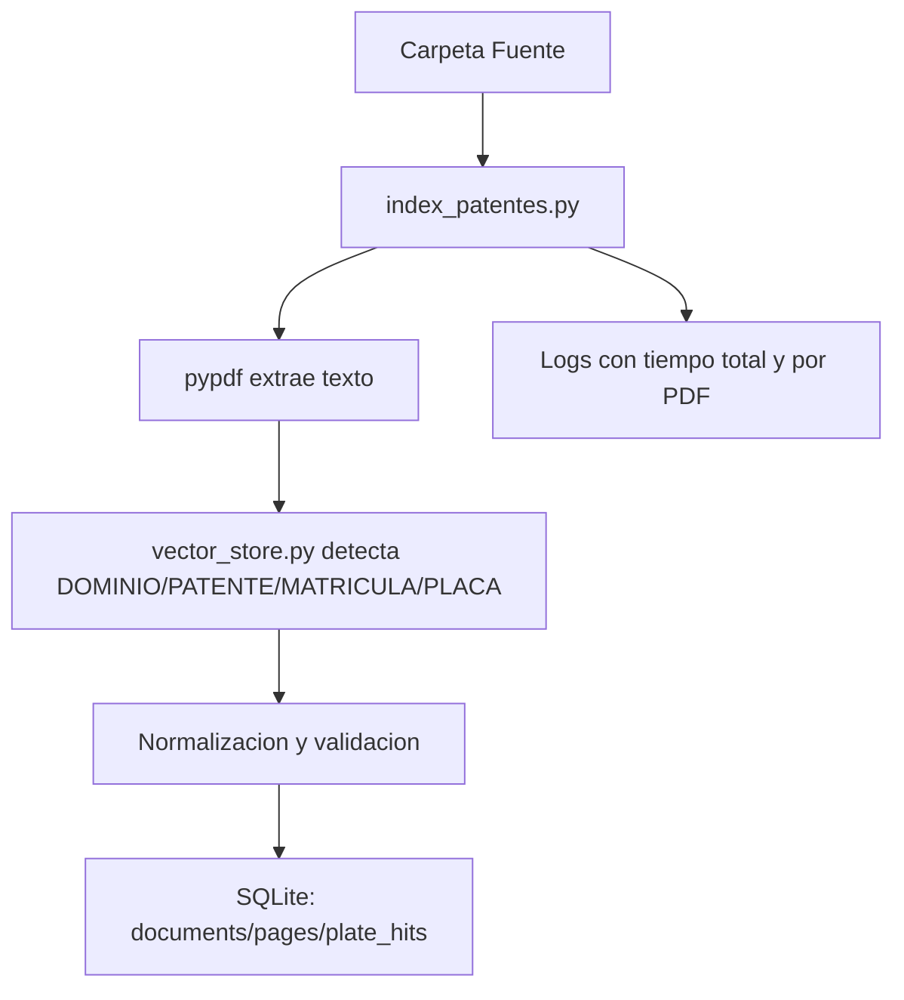
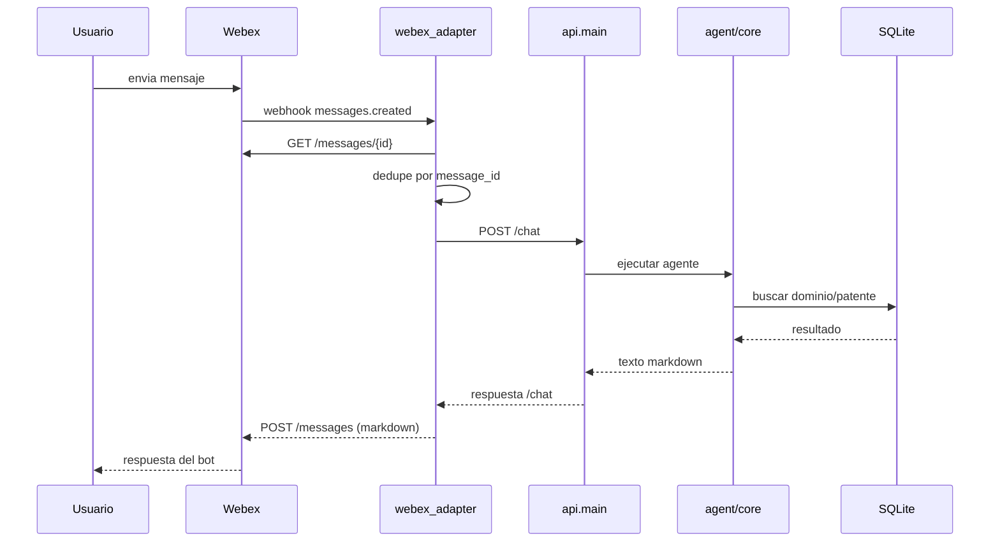

<!-- NOTA: Vista general del proyecto. Mantener en espanol y sin secretos. -->
# Arquitectura general

Este documento explica el proyecto completo, desde el indexado de PDFs hasta la
conversacion de usuarios por Webex.

## Vista global

El sistema tiene dos planos principales:

1. **Plano de preparacion de datos**
   - lee PDFs
   - extrae dominios/patentes y metadatos
   - construye el indice SQLite

2. **Plano conversacional**
   - recibe mensajes desde UI web, CLI o Webex
   - consulta el backend del agente
   - devuelve una respuesta con markdown y links al PDF

## Componentes

- `src/agent`: logica del agente, prompts, herramientas y memoria.
- `src/api`: backend FastAPI que expone `POST /chat`, `POST /chat_debug`, `GET /docs/{rel_path}` y `GET /ui`.
- `src/webex_adapter`: adaptador HTTP/Webex que recibe webhooks y reenvia a `POST /chat`.
- `data/index/patentes.sqlite`: indice construido a partir de los PDFs.
- `data/conversations.jsonl`: transcript de conversaciones.
- `data/webex_adapter/webex_events.sqlite`: deduplicacion de eventos Webex.

## Recorrido A -> Z

### Preparacion de datos

A. los PDFs viven en la carpeta fuente  
B. `scripts/index_patentes.py` los recorre  
C. `vector_store.py` extrae texto y detecta etiquetas utiles  
D. se normalizan dominios y metadatos  
E. se persiste el indice en SQLite  

### Conversacion

F. un usuario consulta por UI, API, CLI o Webex  
G. el mensaje entra al backend `POST /chat` o al adaptador Webex  
H. el agente decide si necesita herramienta de busqueda  
I. la herramienta consulta el indice SQLite  
J. el backend compone la respuesta final con markdown y link al PDF  
K. la respuesta vuelve al usuario por el canal correspondiente  
L. transcript y logs quedan persistidos para trazabilidad  

## Diagrama: sistema completo

```mermaid
flowchart LR
    A[PDFs fuente] --> B[scripts/index_patentes.py]
    B --> C[data/index/patentes.sqlite]
    U[Usuario Webex] --> W[Webex Cloud]
    W --> X[src/webex_adapter]
    X --> Y[POST /chat en src/api]
    Y --> Z[src/agent]
    Z --> C
    Y --> D[GET /docs/{rel_path}]
    X --> W
```

## Diagrama: indexado



## Diagrama: conversacion via Webex



## Que rol cumple cada superficie

### UI web

- URL: `http://localhost:8000/ui`
- sirve para pruebas de desarrollo
- usa `/chat_debug`
- muestra respuesta y trazas tecnicas

### API `/chat`

- es el contrato estable del backend
- lo usan la UI, la CLI y Webex
- centraliza la logica del agente

### Adaptador Webex

- solo resuelve transporte
- no indexa PDFs
- no ejecuta busquedas directas en SQLite
- no mantiene la logica del agente

## Persistencias

### Indice SQLite

- archivo principal: `data/index/patentes.sqlite`
- contiene hits de dominios y metadatos por pagina

### Transcript

- archivo: `data/conversations.jsonl`
- registra mensajes de usuario y respuesta
- puede guardar `channel` (`ui`, `api`, `cli`, `webex`)

### Dedupe Webex

- archivo: `data/webex_adapter/webex_events.sqlite`
- evita responder dos veces al mismo `message_id`

## Donde mirar cuando algo falla

- backend: `data/logs/patentes_agent.log`
- errores backend: `data/logs/patentes_agent.error.log`
- errores de indexado: `data/logs/patentes_agent.index_errors.log`
- estado del adaptador: `GET /webex/health`

## Documentos relacionados

- `doc/TUNEL_PUBLICO.md`
- `doc/WEBEX_WEBHOOK.md`
- `doc/PRUEBA_END_TO_END.md`
- `doc/MIGRACION_PRODUCCION.md`
