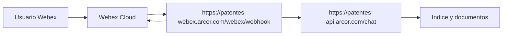

<!-- NOTA: Guia de endpoints estables. Mantener en espanol y sin secretos. -->
# Endpoints publicos estables

Este documento resume que hace falta para dejar de depender de `localhost` y de
tuneles temporales, y pasar a una arquitectura con URLs publicas estables.

## Idea central

Para operar este proyecto de forma seria no hacen falta tres endpoints publicos.
Hacen falta **dos**:

1. uno para el backend de Patentes
2. uno para el adaptador Webex

El tunel publico deja de ser necesario cuando ambos servicios ya tienen una URL
publica estable.

## Ejemplo concreto

Arquitectura objetivo:

- backend Patentes: `https://patentes-api.arcor.com`
- adaptador Webex: `https://patentes-webex.arcor.com`
- webhook registrado en Webex:
  - `https://patentes-webex.arcor.com/webex/webhook`

Configuracion asociada:

```env
DOCS_BASE_URL=https://patentes-api.arcor.com
PATENTES_API_BASE_URL=https://patentes-api.arcor.com
```

## Que significa "endpoint publico estable"

Es una URL que:

- es accesible desde Internet
- usa HTTPS valido
- no cambia en cada reinicio
- no depende de tener un tunel abierto manualmente
- puede registrarse una sola vez en Webex

Ejemplo estable:

```text
https://patentes-webex.arcor.com/webex/webhook
```

Ejemplo no estable:

```text
https://a1571b19e21a42.lhr.life/webex/webhook
```

La segunda URL depende de un tunel temporal y suele cambiar de una sesion a otra.

## Que hace falta para tener endpoints estables

### 1. Infraestructura publicada a Internet

Alguna plataforma que exponga servicios HTTP/HTTPS:

- VM con IP publica
- App Service
- Container Apps
- Cloud Run
- Kubernetes con ingress
- equivalente corporativo

No alcanza con una notebook local o una IP privada de VPN.

### 2. DNS

Subdominios dedicados, por ejemplo:

- `patentes-api.arcor.com`
- `patentes-webex.arcor.com`

Esos DNS deben apuntar a:

- una IP publica
- o un hostname administrado por la plataforma

### 3. HTTPS / TLS

Se necesita un certificado valido para esos dominios.

Webex debe poder llamar por HTTPS al adaptador. No es recomendable operar esto
por HTTP plano.

### 4. Reverse proxy / ingress / load balancer

Hace falta una capa que reciba trafico publico y lo dirija al servicio correcto.

Ejemplos:

- `https://patentes-api.arcor.com` -> backend `api.main:app`
- `https://patentes-webex.arcor.com` -> adaptador `webex_adapter.main:app`

### 5. Servicios desplegados

Servicios minimos:

- backend del agente:
  - `api.main:app`
- adaptador Webex:
  - `webex_adapter.main:app`

El indexado no deberia ejecutarse dentro del arranque del backend de chat.

### 6. Variables de entorno correctas

En backend:

```env
DOCS_BASE_URL=https://patentes-api.arcor.com
```

En adaptador:

```env
PATENTES_API_BASE_URL=https://patentes-api.arcor.com
```

### 7. Secretos fuera de `.env` local

Secretos minimos:

- `GOOGLE_API_KEY`
- `WEBEX_BOT_TOKEN`
- `WEBEX_WEBHOOK_SECRET`

Idealmente deben vivir en:

- Azure Key Vault
- Secret Manager
- variables seguras del runtime

### 8. Persistencia real

Revisar estos componentes:

- indice SQLite
- `WEBEX_DEDUPE_STORE`
- `PATENTES_SESSION_STORE`
- `PATENTES_TRANSCRIPT_PATH`

Si los servicios reinician o escalan horizontalmente, no alcanza con archivos
efimeros de una sola instancia.

### 9. Red saliente habilitada

El adaptador necesita salida a:

- `webexapis.com`

El backend necesita salida a:

- APIs de Google / Gemini

Si existe proxy corporativo, WAF o restricciones de egress, eso debe quedar
contemplado desde el principio.

## Que deja de ser necesario

Si la arquitectura ya tiene endpoints estables, ya no hace falta:

- `localhost.run`
- `ngrok`
- `cloudflared`
- `ssh -R 80:localhost:8010`
- recrear el webhook en Webex por cada prueba

## Beneficio operativo

Con endpoints estables:

- el webhook se registra una sola vez
- Webex siempre sabe a donde entregar eventos
- no dependes de la notebook prendida
- no dependes de la VPN para recibir mensajes
- no dependes de un tunel efimero

## Relacion con el problema actual de pruebas Webex

Si hoy:

- el bot existe
- el bot ve la sala
- Webex registra tus mensajes
- pero el adaptador no recibe `POST /webex/webhook`

entonces un endpoint publico estable deja de depender del tramo fragil:

- notebook local
- tunel efimero
- VPN corporativa
- proxy o inspeccion sobre el tunel

Ese es el fundamento tecnico para pedir infraestructura estable.

## Resumen practico para pedir infraestructura

Pedido minimo con fundamento:

1. un endpoint HTTPS estable para el backend del agente
2. un endpoint HTTPS estable para el adaptador Webex
3. DNS dedicados para ambos servicios
4. certificados TLS validos
5. despliegue persistente de ambos servicios
6. gestion segura de secretos
7. almacenamiento persistente para indice, dedupe, sesiones y transcript
8. salida de red permitida hacia Webex y Gemini

## Diagrama simple



## Documentos relacionados

- `doc/MIGRACION_PRODUCCION.md`
- `doc/WEBEX_WEBHOOK.md`
- `doc/TUNEL_PUBLICO.md`
- `doc/ARQUITECTURA_GENERAL.md`
