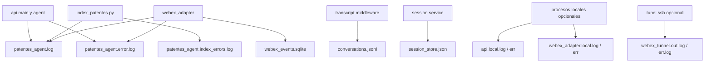

<!-- NOTA: Guia de observabilidad. Mantener en espanol y sin secretos. -->
# Logs y observabilidad

Este documento explica que archivos existen para seguimiento tecnico del proyecto,
quien los genera, por que existen y cuando conviene mirarlos.

## Principio general

No todo archivo operativo es un "log".

En este proyecto existen tres grupos:

1. **logs de aplicacion**
2. **persistencias tecnicas**
3. **logs opcionales de proceso local**

## Mapa rapido

| Archivo | Tipo | Lo genera | Para que existe |
| --- | --- | --- | --- |
| `data/logs/patentes_agent.log` | log de aplicacion | `agent.logging_config.setup_logging()` | ver actividad general del backend, indexado y adaptador |
| `data/logs/patentes_agent.error.log` | log de aplicacion | `agent.logging_config.setup_logging()` | aislar errores del backend y del adaptador |
| `data/logs/patentes_agent.index_errors.log` | log de aplicacion | logger `agent.index` | registrar errores o warnings de indexado por PDF/pagina |
| `data/conversations.jsonl` | transcript | middleware/API | guardar conversacion usuario-agente para trazabilidad funcional |
| `data/session_store.json` | estado de sesion | servicio de sesiones | mantener continuidad conversacional entre requests |
| `data/webex_adapter/webex_events.sqlite` | persistencia tecnica | `webex_adapter.dedupe` | evitar reprocesar el mismo `message_id` de Webex |
| `data/index/patentes.sqlite` | base operativa | indexador | almacenar el indice consultable del agente |
| `data/sharepoint_cache/.manifest.json` | persistencia tecnica | `agent.sources.sharepoint_client` | recordar `etag`, `last_modified` y metadatos remotos para sync incremental |
| `data/logs/api.local.log` | log opcional de proceso | arranque manual con redireccion | capturar `stdout` del proceso local del backend |
| `data/logs/api.local.err.log` | log opcional de proceso | arranque manual con redireccion | capturar `stderr` del backend local |
| `data/logs/webex_adapter.local.log` | log opcional de proceso | arranque manual con redireccion | capturar `stdout` del adaptador Webex local |
| `data/logs/webex_adapter.local.err.log` | log opcional de proceso | arranque manual con redireccion | capturar `stderr` del adaptador Webex local |
| `data/logs/webex_tunnel.out.log` | log opcional de proceso | tunel `ssh` redirigido | ver URL publica generada por el tunel |
| `data/logs/webex_tunnel.err.log` | log opcional de proceso | tunel `ssh` redirigido | ver errores o estado del tunel |

## Logs de aplicacion

### `data/logs/patentes_agent.log`

Rol:
- es el log principal del proyecto
- concentra eventos `INFO` y superiores
- sirve para entender el recorrido normal del sistema

Lo genera:
- `src/agent/logging_config.py`

Contenido esperado:
- arranque de backend y adaptador
- requests salientes a Webex
- requests salientes a Gemini/ADK
- resumenes de sync SharePoint con requests, descargas y bytes
- eventos del agente
- tiempos de indexado por PDF
- resumen total del indexado

Miralo cuando:
- queres ver que paso en un flujo que "funciono mal"
- queres seguir una conversacion o una llamada a `/chat`
- queres confirmar que el adaptador realmente proceso un mensaje

### `data/logs/patentes_agent.error.log`

Rol:
- aislar errores sin mezclar ruido informativo

Lo genera:
- `src/agent/logging_config.py`

Contenido esperado:
- excepciones del backend
- errores del adaptador
- trazas de fallos del agente

Miralo cuando:
- la UI responde error
- Webex no devuelve nada
- `/chat` o `/webex/webhook` devuelven 5xx

### `data/logs/patentes_agent.index_errors.log`

Rol:
- separar problemas de lectura/indexado de PDFs del resto del sistema

Lo genera:
- logger `agent.index`, configurado en `src/agent/logging_config.py`

Contenido esperado:
- paginas que fallaron al extraerse
- PDFs problematicos
- warnings de indexado

Miralo cuando:
- el reindexado parece incompleto
- faltan dominios que deberian existir
- hay errores de `pypdf`
- aparece un `MemoryError` en una pagina puntual y queres confirmar si la corrida continuo

## Persistencias tecnicas que no son logs

### `data/conversations.jsonl`

Rol:
- transcript funcional del sistema
- deja rastro de que pregunto el usuario y que respondio el agente

No es un log tecnico porque:
- esta orientado a negocio/conversacion
- no registra excepciones ni telemetria de bajo nivel

### `data/session_store.json`

Rol:
- guardar el estado de sesion del agente entre requests

No es un log porque:
- su funcion es persistir memoria conversacional

### `data/webex_adapter/webex_events.sqlite`

Rol:
- deduplicacion persistente de eventos de Webex

Existe para:
- no responder dos veces al mismo mensaje
- sobrevivir reinicios del adaptador
- marcar estados `processing`, `processed` o `ignored`

No es un log porque:
- no es una secuencia narrativa de eventos
- es un store tecnico de control

### `data/index/patentes.sqlite`

Rol:
- base operativa del buscador

No es un log porque:
- es el indice consultado por el agente

### `data/sharepoint_cache/.manifest.json`

Rol:
- recordar estado remoto del mirror SharePoint entre corridas

Existe para:
- comparar `etag`, `last_modified` y `size`
- omitir descargas sin cambios
- eliminar archivos ausentes al reconciliar

No es un log porque:
- es un store de metadatos tecnicos
- no representa una narrativa temporal de eventos

## Logs opcionales de proceso local

Estos archivos aparecen solo si los procesos se levantan con redireccion de
salida a archivo. No forman parte del logging central del proyecto.

### `data/logs/api.local.log` y `data/logs/api.local.err.log`

Rol:
- capturar `stdout` y `stderr` del proceso `uvicorn` del backend

Utilidad:
- ver mensajes de arranque/parada de Uvicorn
- diagnosticar errores antes de que entren al logger de aplicacion

### `data/logs/webex_adapter.local.log` y `data/logs/webex_adapter.local.err.log`

Rol:
- capturar `stdout` y `stderr` del proceso del adaptador Webex

Utilidad:
- ver si el servicio arranco
- ver errores de import o de bootstrap
- confirmar salud local del adaptador

### `data/logs/webex_tunnel.out.log` y `data/logs/webex_tunnel.err.log`

Rol:
- capturar lo que imprime el tunel `ssh`/`localhost.run`

Utilidad:
- recuperar la URL publica del tunel
- ver si el tunel cayo o si hubo un error de autenticacion

## Diagrama: observabilidad

## Orden recomendado de diagnostico

### Si falla una conversacion por UI o API

1. `data/logs/patentes_agent.error.log`
2. `data/logs/patentes_agent.log`
3. `data/conversations.jsonl`

### Si falla el indexado

1. `data/logs/patentes_agent.index_errors.log`
2. `data/logs/patentes_agent.log`
3. `data/index/patentes.sqlite`

### Si falla Webex

1. `data/logs/webex_adapter.local.err.log` si el servicio fue levantado con redireccion
2. `data/logs/patentes_agent.error.log`
3. `data/logs/patentes_agent.log`
4. `data/webex_adapter/webex_events.sqlite`
5. `data/logs/webex_tunnel.out.log` y `data/logs/webex_tunnel.err.log`

## Que no deberia ir a los logs

- tokens de Webex
- `GOOGLE_API_KEY`
- secretos de webhook
- contenido sensible que no sea necesario para diagnostico

## Documentos relacionados

- `README.md`
- `doc/ARQUITECTURA_GENERAL.md`
- `doc/PRUEBA_END_TO_END.md`
- `src/webex_adapter/README.md`
