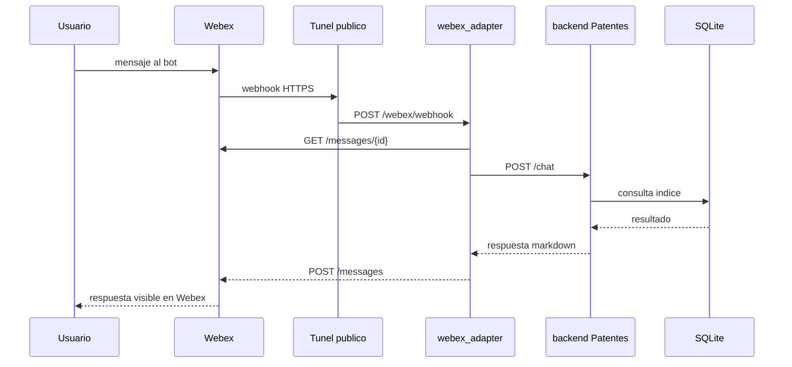

<!-- NOTA: Guia de prueba end-to-end. Mantener en espanol y sin secretos. -->
# Prueba end-to-end

Esta guia concentra en un solo lugar el circuito completo de prueba de Webex
contra el backend de `Patentes`.

## Objetivo

Validar el flujo completo:

1. Usuario escribe al bot en Webex
2. Webex envia webhook al adaptador
3. El adaptador consulta el detalle del mensaje
4. El adaptador llama a `POST /chat`
5. El backend responde
6. El adaptador publica markdown en Webex

## Requisitos previos

- indice SQLite ya construido
- `.env` completo
- `WEBEX_BOT_TOKEN` valido
- `WEBEX_WEBHOOK_SECRET` configurado
- backend y adaptador instalados en el entorno virtual

## Procedimiento completo en 10 pasos

### 1. Verificar configuracion minima en `.env`

En `Patentes/patentes_agent/.env` deben existir al menos:

- `WEBEX_BOT_TOKEN`
- `WEBEX_WEBHOOK_SECRET`
- `PATENTES_API_BASE_URL=http://localhost:8000`
- `GOOGLE_API_KEY`
- `PATENTES_INDEX_DB`
- `DOCS_BASE_URL=http://localhost:8000`

### 2. Verificar que el indice exista

```powershell
python scripts/inspect_db.py --stats
```

Si este paso falla, no tiene sentido probar Webex todavia.

### 3. Levantar backend Patentes

```powershell
python -m uvicorn api.main:app --host 0.0.0.0 --port 8000 --reload
```

Chequeo rapido:

```powershell
Invoke-RestMethod -Method Get -Uri "http://localhost:8000/ui" | Out-Null
```

### 4. Levantar adaptador Webex

```powershell
python -m uvicorn webex_adapter.main:app --host 0.0.0.0 --port 8010 --reload
```

Chequeo rapido:

```powershell
Invoke-RestMethod -Method Get -Uri "http://localhost:8010/webex/health"
```

Debe devolver `status: ok`.

### 5. Abrir tunel publico HTTPS

```powershell
ssh -o StrictHostKeyChecking=no -o ServerAliveInterval=60 -o ExitOnForwardFailure=yes -R 80:localhost:8010 nokey@localhost.run
```

La salida va a mostrar una URL publica tipo:

```text
https://xxxxxxxxxxxx.lhr.life
```

Importante:
- si cerras esa consola, el tunel muere
- si cambia la URL, el webhook viejo deja de servir

### 6. Listar o crear el webhook de Webex

Primero podes listar lo existente:

```powershell
$token = (Get-Content .env | Where-Object { $_ -match '^WEBEX_BOT_TOKEN=' } | ForEach-Object { ($_ -split '=', 2)[1] })

Invoke-RestMethod `
  -Method Get `
  -Uri "https://webexapis.com/v1/webhooks" `
  -Headers @{ Authorization = "Bearer $token" }
```

Si no existe uno valido para la URL publica actual, crealo:

```powershell
$token = (Get-Content .env | Where-Object { $_ -match '^WEBEX_BOT_TOKEN=' } | ForEach-Object { ($_ -split '=', 2)[1] })
$secret = (Get-Content .env | Where-Object { $_ -match '^WEBEX_WEBHOOK_SECRET=' } | ForEach-Object { ($_ -split '=', 2)[1] })
$targetUrl = "https://<url-publica>/webex/webhook"

$body = @{
  name = "patentes-webhook"
  targetUrl = $targetUrl
  resource = "messages"
  event = "created"
  secret = $secret
} | ConvertTo-Json

Invoke-RestMethod `
  -Method Post `
  -Uri "https://webexapis.com/v1/webhooks" `
  -Headers @{ Authorization = "Bearer $token" } `
  -ContentType "application/json" `
  -Body $body
```

### 7. Enviar un mensaje real al bot

Ejemplos recomendados:

- `Dame informacion de la patente AUT230`
- `Buscá el dominio ILD070 y pasame el link del PDF`

### 8. Validar el resultado esperado

El flujo correcto es:

- Webex envia webhook
- el adaptador recibe el evento
- el adaptador consulta el mensaje real
- el adaptador llama a `POST /chat`
- el backend responde
- Webex muestra la respuesta markdown del bot

## Diagrama: prueba total



### 9. Revisar logs si algo falla

En este orden:

- `data/logs/webex_adapter.local.err.log`
- `data/logs/patentes_agent.error.log`
- `data/logs/patentes_agent.log`
- `data/logs/webex_tunnel.out.log`
- `data/logs/webex_tunnel.err.log`

Y si hace falta ver dedupe:

- `data/webex_adapter/webex_events.sqlite`

### 10. Contrastar fallas comunes

Las causas mas frecuentes son:

- tunel caido
- webhook apuntando a URL vieja
- `WEBEX_WEBHOOK_SECRET` distinto entre Webex y `.env`
- backend `8000` no levantado
- otro proceso viejo de `PyWebex` respondiendo tambien
- mas de un webhook activo
- VPN/proxy corporativo interfiriendo con la entrega del webhook al tunel

## Caso especial: el bot ve tus mensajes pero no responde

Si se verifica todo esto:

- el room 1:1 existe
- el bot es visible en Webex
- tus mensajes aparecen en la API de Webex
- pero no entra ningun `POST /webex/webhook` al adaptador

la conclusion operativa es:

- el codigo del adaptador no es el primer sospechoso
- la falla esta en la entrega del webhook hacia el endpoint publico temporal
- mientras no exista reachability publica confiable, la UI local sigue siendo
  el canal de prueba vigente para validar el agente

## Resultado esperado en logs

En logs del adaptador deberias ver:

- webhook recibido
- `GET /messages/{id}`
- `Patentes POST /chat -> 200`
- `POST /messages -> 200`

En logs del backend deberias ver:

- entrada de request a `/chat`
- herramientas ejecutadas si corresponde
- transcript persistido

## Criterio de exito

La prueba es correcta si:

- el mensaje entra desde Webex
- el adaptador lo procesa una sola vez
- el backend responde sin error
- el usuario ve la respuesta final en la sala de Webex

## Referencias relacionadas

- `doc/TUNEL_PUBLICO.md`
- `doc/WEBEX_WEBHOOK.md`
- `doc/LOGS_Y_OBSERVABILIDAD.md`
