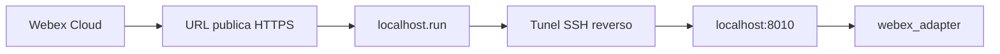

<!-- NOTA: Explicacion de tuneles publicos para desarrollo local. Mantener en espanol y sin secretos. -->
# Tunel publico

Este documento explica que es un tunel publico, por que hace falta cuando el
proyecto corre en `localhost`, y como usar `localhost.run` para exponer el
adaptador Webex.

## Problema de base

Cuando el adaptador corre en esta maquina, escucha en:

```text
http://localhost:8010
```

`localhost` significa:
- "esta misma maquina"
- direccion privada, no publica
- visible solo desde este equipo

Webex vive afuera de esta maquina, en Internet. Por lo tanto, **Webex no puede
llamar a `http://localhost:8010`**.

## Que es un tunel publico

Un tunel publico es un servicio intermediario que:

1. abre una URL publica HTTPS en Internet
2. recibe trafico ahi
3. reenvia ese trafico a un puerto local de tu maquina

En este caso:

- URL publica -> `https://algo.localhost.run`
- destino local -> `http://localhost:8010`

## Que hace `localhost.run`

`localhost.run` usa un **tunel reverso sobre SSH**.

Cuando ejecutas:

```powershell
ssh -o StrictHostKeyChecking=no -o ServerAliveInterval=60 -o ExitOnForwardFailure=yes -R 80:localhost:8010 nokey@localhost.run
```

estas pidiendo:

- abrir una sesion SSH saliente hacia `localhost.run`
- reservar un endpoint publico remoto
- todo lo que llegue a ese endpoint remoto en el puerto `80/443`
- reenviarlo a `localhost:8010` de tu maquina

## Diagrama: tunel



## Por que la URL publica tiene ese nombre raro

Ejemplo real:

```text
https://0ad0f45f50cb99.lhr.life
```

Ese nombre:
- no es un DNS tuyo
- no es una URL fija del proyecto
- no lo elegiste vos
- lo genera el proveedor del tunel

Que suele significar:
- `0ad0f45f50cb99`: identificador temporal o aleatorio del tunel
- `lhr.life`: dominio/subdominio administrado por el proveedor

Funcion:
- sirve como direccion publica temporal
- mientras la sesion SSH siga viva, el proveedor mantiene esa URL asociada a tu maquina
- si cerras el proceso `ssh`, la URL deja de funcionar

## Diferencia entre tunel temporal y DNS productivo

### Tunel temporal

- ideal para pruebas
- rapido
- no requiere abrir puertos del router ni crear DNS propio
- URL efimera

### DNS productivo

- dominio estable
- HTTPS permanente
- suele apuntar a un balanceador, reverse proxy o ingress
- apto para operacion continua

## Practica en este proyecto

### Paso 1: levantar el backend

```powershell
python -m uvicorn api.main:app --host 0.0.0.0 --port 8000 --reload
```

### Paso 2: levantar el adaptador Webex

```powershell
python -m uvicorn webex_adapter.main:app --host 0.0.0.0 --port 8010 --reload
```

### Paso 3: verificar salud local

```powershell
Invoke-RestMethod -Method Get -Uri "http://localhost:8010/webex/health"
```

### Paso 4: abrir el tunel

```powershell
ssh -o StrictHostKeyChecking=no -o ServerAliveInterval=60 -o ExitOnForwardFailure=yes -R 80:localhost:8010 nokey@localhost.run
```

### Paso 5: copiar la URL publica

La salida del comando muestra algo como:

```text
https://xxxxxxxxxxxx.lhr.life
```

Esa es la base del webhook:

```text
https://xxxxxxxxxxxx.lhr.life/webex/webhook
```

## Riesgos practicos

- si el `ssh` se corta, Webex ya no puede llegar al adaptador
- la URL puede cambiar cada vez que abras el tunel
- si reinicias la notebook, el tunel desaparece
- no es una solucion productiva
- una VPN corporativa, proxy de inspeccion o WAF puede interferir con el trafico y hacer que Webex no logre entregar el webhook aunque la URL exista

## Señales de interferencia de red corporativa

Si ocurre esta combinacion:

- el bot existe y ve la sala
- Webex registra tus mensajes en el room
- el adaptador responde localmente en `/webex/health`
- pero nunca aparece `POST /webex/webhook` en logs

entonces la sospecha principal pasa a ser la red intermedia:

- VPN
- proxy corporativo
- inspeccion TLS
- politica de salida/entrada sobre el tunel

En ese escenario el problema ya no esta en el agente ni en el backend de Patentes,
sino en la reachability del endpoint publico temporal.

## Cuando usarlo

Usalo para:
- pruebas locales
- validar webhook
- comprobar que el circuito Webex -> Patentes responde

No usarlo como arquitectura final de produccion.

## Documentos relacionados

- `doc/WEBEX_WEBHOOK.md`
- `doc/PRUEBA_END_TO_END.md`
- `doc/MIGRACION_PRODUCCION.md`
