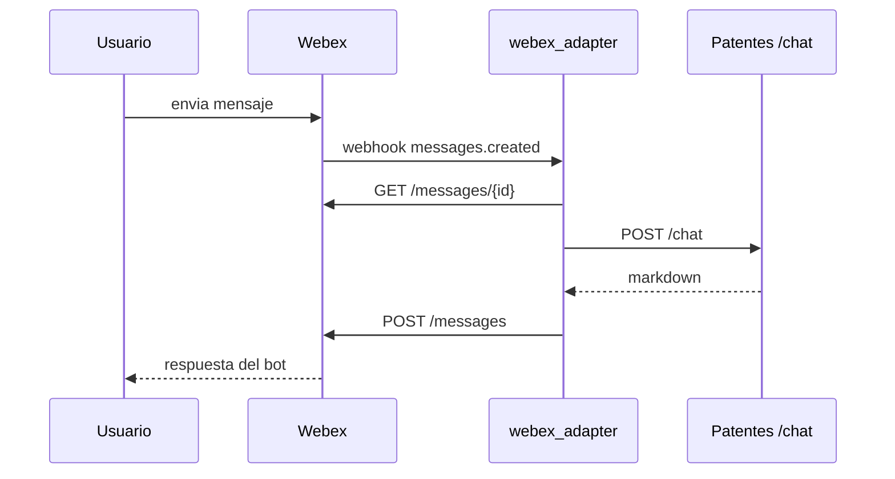

<!-- NOTA: Guia de webhook Webex. Mantener en espanol y sin secretos. -->
# Webhook de Webex

Este documento cubre la teoria y la practica del webhook que usa el proyecto
para conectar Webex con el backend `Patentes`.

## Rol del webhook

El webhook es el mecanismo por el cual Webex notifica al adaptador que se creo un mensaje.

URL objetivo del proyecto:

```text
https://<url-publica>/webex/webhook
```

## Teoria: que es un webhook en este proyecto

Un webhook es una llamada HTTP saliente que hace Webex cuando ocurre un evento.

En este proyecto:

- evento observado: `messages.created`
- origen: Webex Cloud
- destino: `src/webex_adapter/main.py`
- endpoint: `POST /webex/webhook`

La idea central es:

1. el usuario manda un mensaje al bot
2. Webex genera un evento
3. Webex llama al adaptador
4. el adaptador pide a Webex el detalle completo del mensaje
5. el adaptador reenvia el texto a `POST /chat`
6. el adaptador responde al usuario con markdown

## Diagrama: webhook



## Antes de crearlo

Necesitas:

- backend Patentes levantado y accesible
- adaptador Webex levantado
- una URL publica HTTPS para el adaptador
- `WEBEX_BOT_TOKEN`
- `WEBEX_WEBHOOK_SECRET`

## Como obtener una URL publica de prueba

Para pruebas locales no conviene crear un DNS `A` apuntando a una IP privada.
La opcion practica es abrir un tunel HTTPS temporal hacia el puerto `8010`.

Ejemplo con `localhost.run`:

```powershell
ssh -o StrictHostKeyChecking=no -o ServerAliveInterval=60 -o ExitOnForwardFailure=yes -R 80:localhost:8010 nokey@localhost.run
```

La salida incluye una URL `https://...` publica. Esa URL es la base del webhook:

```text
https://<url-publica>/webex/webhook
```

Notas:
- si el proceso `ssh` termina, la URL deja de existir
- para produccion se necesita un dominio estable y HTTPS permanente
- el webhook debe apuntar al adaptador Webex, no al backend `api.main`

## Como funciona internamente el webhook ya creado

Cuando Webex llama `POST /webex/webhook`:

1. `webhook_handler.py` valida el body
2. si existe `WEBEX_WEBHOOK_SECRET`, verifica `X-Spark-Signature`
3. `service.py` deduplica por `message_id`
4. `client.py` consulta `GET /messages/{id}` en Webex
5. se arma `user_id` y `session_id`
6. se llama `POST /chat` en el backend
7. se publica la respuesta con `markdown`

## Practica: como verificar que el webhook funciona

### Health local del adaptador

```powershell
Invoke-RestMethod -Method Get -Uri "http://localhost:8010/webex/health"
```

### Listar webhooks activos

```powershell
Invoke-RestMethod `
  -Method Get `
  -Uri "https://webexapis.com/v1/webhooks" `
  -Headers @{ Authorization = "Bearer $token" }
```

### Confirmar logs tras enviar un mensaje

Revisar:

```text
data/logs/webex_adapter.local.log
data/logs/webex_adapter.local.err.log
data/logs/patentes_agent.log
```

## Como rastrear si el webhook no entrega eventos

Orden recomendado:

1. confirmar la identidad real del bot con `GET /people/me`
2. confirmar que el room 1:1 existe y que Webex registra tus mensajes
3. confirmar que el webhook activo apunta a la URL publica vigente
4. confirmar que el adaptador local responde en `http://localhost:8010/webex/health`
5. revisar si aparece `POST /webex/webhook` en `webex_adapter.local.log`

Interpretacion:

- si el bot ve la sala y tus mensajes existen en Webex, pero nunca aparece
  `POST /webex/webhook` en logs, la falla esta entre Webex y el endpoint publico
- en entorno corporativo eso suele apuntar a VPN, proxy, inspeccion TLS o
  reachability deficiente del tunel
- en ese caso la UI local sigue siendo la superficie de prueba valida hasta
  disponer de un endpoint estable o una red sin interferencia

## Crear webhook por API

PowerShell:

```powershell
$token = "<WEBEX_BOT_TOKEN>"
$secret = "<WEBEX_WEBHOOK_SECRET>"
$targetUrl = "https://<tu-url-publica>/webex/webhook"

$body = @{
  name = "patentes-webhook"
  targetUrl = $targetUrl
  resource = "messages"
  event = "created"
  secret = $secret
} | ConvertTo-Json

Invoke-RestMethod `
  -Method Post `
  -Uri "https://webexapis.com/v1/webhooks" `
  -Headers @{ Authorization = "Bearer $token" } `
  -ContentType "application/json" `
  -Body $body
```

Variante sin copiar secretos a mano, leyendo desde `.env`:

```powershell
$token = (Get-Content .env | Where-Object { $_ -match '^WEBEX_BOT_TOKEN=' } | ForEach-Object { ($_ -split '=', 2)[1] })
$secret = (Get-Content .env | Where-Object { $_ -match '^WEBEX_WEBHOOK_SECRET=' } | ForEach-Object { ($_ -split '=', 2)[1] })
$targetUrl = "https://<tu-url-publica>/webex/webhook"

$body = @{
  name = "patentes-webhook"
  targetUrl = $targetUrl
  resource = "messages"
  event = "created"
  secret = $secret
} | ConvertTo-Json

Invoke-RestMethod `
  -Method Post `
  -Uri "https://webexapis.com/v1/webhooks" `
  -Headers @{ Authorization = "Bearer $token" } `
  -ContentType "application/json" `
  -Body $body
```

## Listar webhooks

```powershell
Invoke-RestMethod `
  -Method Get `
  -Uri "https://webexapis.com/v1/webhooks" `
  -Headers @{ Authorization = "Bearer $token" }
```

## Borrar webhook

```powershell
$webhookId = "<ID_DEL_WEBHOOK>"

Invoke-RestMethod `
  -Method Delete `
  -Uri "https://webexapis.com/v1/webhooks/$webhookId" `
  -Headers @{ Authorization = "Bearer $token" }
```

## Sobre `WEBEX_WEBHOOK_SECRET`

- no lo genera Webex
- lo definis vos
- el mismo valor debe existir tanto en el webhook creado como en el entorno del adaptador
- no cambia solo
- solo cambia si lo rotas manualmente y actualizas ambos lados

## Riesgos concretos

- mas de un webhook activo -> respuestas duplicadas
- webhook apuntando a URL vieja -> mensajes no llegan
- secreto distinto entre Webex y el adaptador -> firma invalida
- tunel caido -> timeout o fallas de entrega
- adaptador viejo por polling todavia activo en otro proceso -> doble respuesta

## Referencias oficiales

- Crear webhook: https://developer.webex.com/docs/api/v1/webhooks/create-a-webhook
- Listar webhooks: https://developer.webex.com/docs/api/v1/webhooks/list-webhooks
- Guia que suele usarse internamente: https://developer.webex.com/meeting/docs/api/v1/webhooks/create-a-webhook
